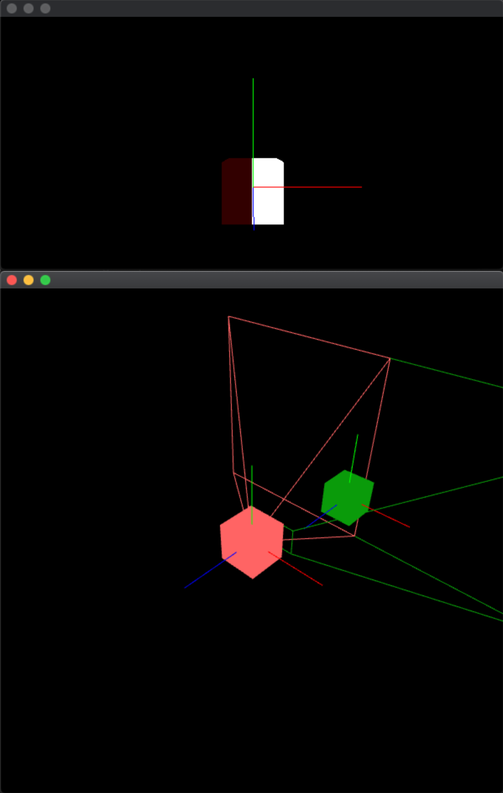

# OpenFrameworks 2-Window FBO Bug
Simple example project that illustrates a bug in OpenFrameworks that occurs when two windows are used in conjuction with FBOs.

May be related to the issue described in on the forums: [ofFbo vertical flip, sometimes](https://forum.openframeworks.cc/t/offbo-vertical-flip-sometimes/21755), despite the application code does not nest FBOs.

